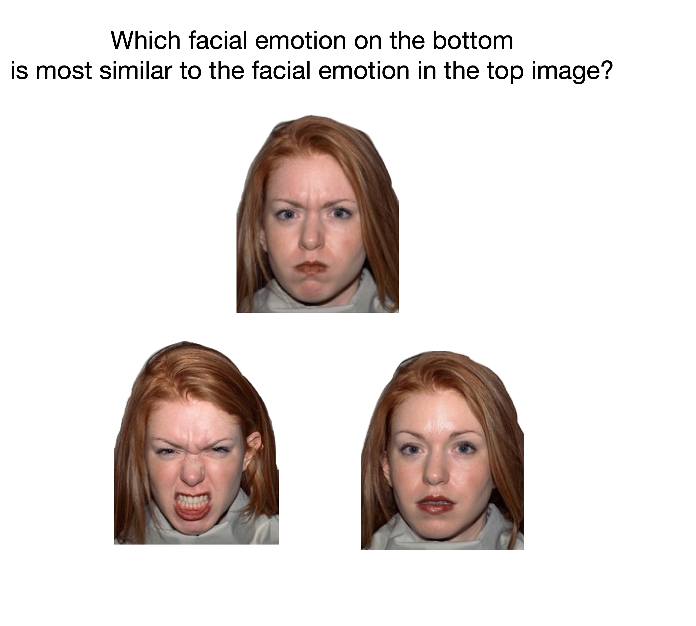

Introduction
============

Salmon is primarily a platform to efficiently collect "triplet queries." These
queries are of the form "is object :math:`a` more similar to object :math:`b`
or :math:`b`?" An example is shown below with facial similarities:

These queries are interesting because they provide some relative similarity
structure: a response might indicate that object :math:`a` is closer to object
:math:`b` than object :math:`c` in some sense.
