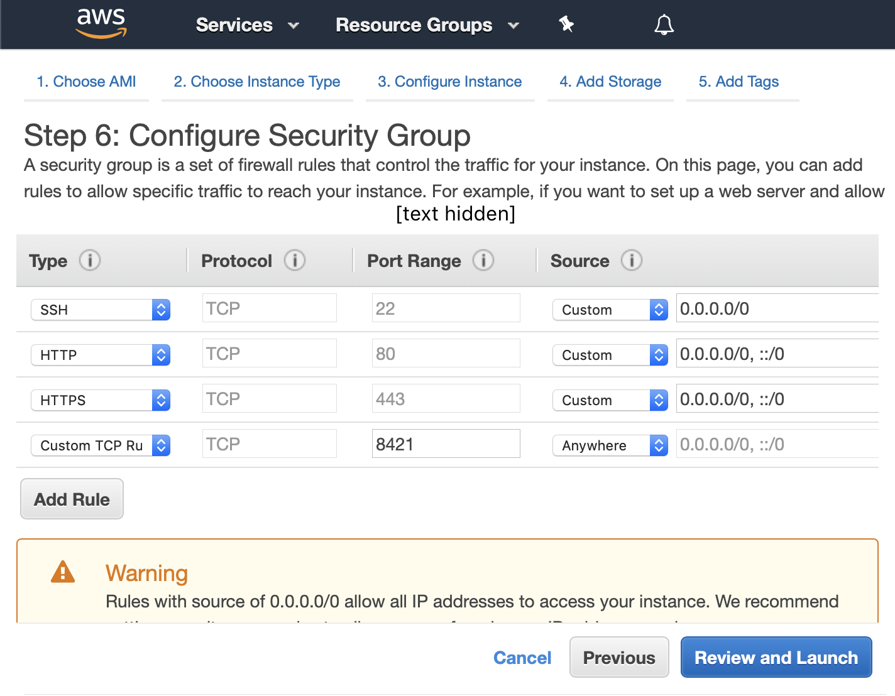

Getting started
===============

Installation
------------
On your local machine? Run ``https://github.com/stsievert/salmon.git``.

Want to use AWS? See below.

Launching Salmon
----------------

Developer
^^^^^^^^^
1. Install docker
2. Run ``docker-compose up``
3. Go to ``localhost:8000/init_exp``

Experimentalist
^^^^^^^^^^^^^^^

.. warning::

   This process is only ready for testing. It is **not** ready for deployment.

1. Sign into Amazon AWS (http://aws.amazon.com/)
2. Select the "Oregon" region (or ``us-west-2``) in the upper right.
3. Go to Amazon EC2
4. Launch a new instance (the big blue button).
5. Select AMI ``ami-06ec58f46ec2d18ea`` titled "Salmon"
   (appears in Community AMIs after searching "Salmon").
6. On the rules page, make a custom TCP rule to open ports 1000-9999 from
   anywhere. Here's a image description:

Then after this AMI is finished launching and initializing, go to

* ``[url]:8000/init_exp`` to initialize an experiment
* ``[url]:8000/docs`` to view documentation. This lists the API endpoints as
  ``/foo``, which means that going to ``[url]:8000/foo`` will perform an action.

``[url]`` is the Amazon public DNS or public IP.

Experiment Launch
-----------------

Visit ``[url]:8000/init_exp`` to initialize an experiment. This will ask for
the following:

* a file describing the experiment
* a username and password

Here's an example experiment file:

.. literalinclude:: ../tests/data/exp.yaml
   :language: yaml
   :linenos:

This file follows the `YAML specification`_.
Each target is a piece of HTML, and will be rendered correctly on the
experiment page.

If you visit ``[url]``, you will see a query page:

.. _YAML specification: https://yaml.org/

.. image:: imgs/query_page.png
   :align: center
   :width: 500px
