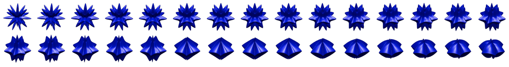
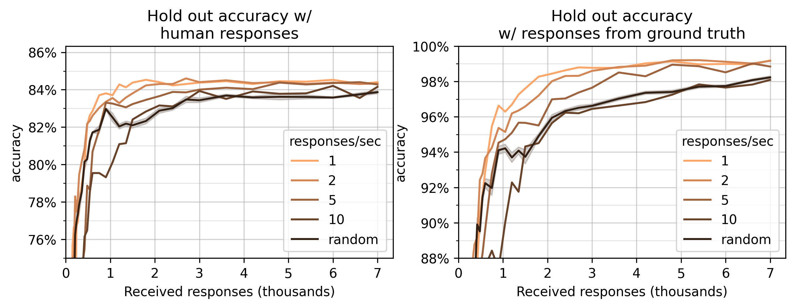
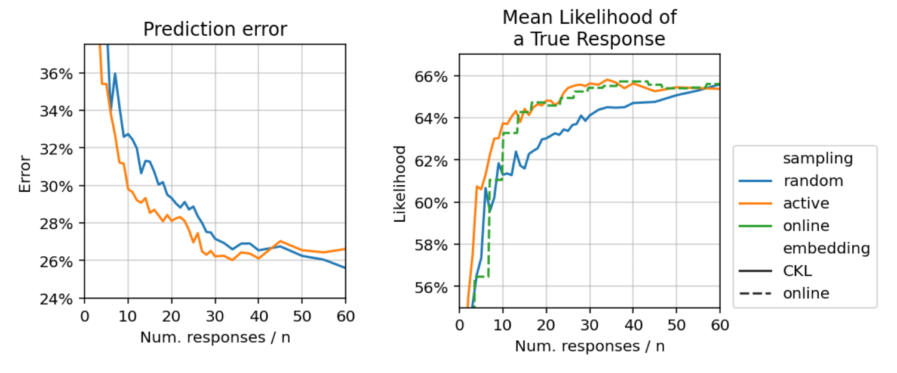

.. _experiments:

Adaptive algorithms
===================

Adaptive algorithms decide which questions to ask about, instead of asking
about a random question like random sampling. This can mean that higher
accuracies are reached sooner, or that less human responses are required to
reach a particular accuracy.

This page will be concerned with the data scientist workflow, and every
experiment below will use the same workflow a data scientists would:

1. Launch Salmon.
2. Simulate human users. [#noise]_
3. Download the human responses from Salmon
4. Generate the embedding offline.

Unless explicitly mentioned, every experiment on this page will use the "alien
eggs" dataset that's characterized by one parameter, the "smoothness" of each
egg. For :math:`n=30` objects, that dataset looks like the following:

These are characterized by one parameter, and have a 1D embedding. However,
let's embed into :math:`d=2` dimensions to simulate a mistake and to mirror
prior work. [2]_ Unless explicitly mentioned, let's compare random and active
sampling with this ``init.yaml`` configuration:

.. code-block:: yaml

   samplers:
     ARR: {random_state: 42}  # active or adaptive sampling
     RandomSampling: {}  # random sampling

The "ARR" stands for "active round robin." That is, the head rotates through
available choices ("round robin") and for each head, the best comparisons are
chosen (by some measure with information gain).

.. note::

   This page shows results of experiments run with Salmon.
   For complete details, see https://github.com/stsievert/salmon-experiments

Response rate
-------------

This section will provide evidence for the following points:

1. **Using adaptive sampling will not degrade embedding quality or accuracy.**
2. **Adaptive sampling finds higher quality embeddings with fewer responses.**
   In one case, adaptive sampling required about 1,250 responses instead of
   3,500 responses like random sampling to reach ground truth accuracy of 97%.
3. **However, response rate determines how much adaptive gains are possible.**
   Having 10 concurrent users will likely still present adaptive gains, but
   they'll be smaller than if there were only 5 concurrent users.

The experiment to confirm these points has been run with (functionally) Salmon
v0.6.0. In this experiment, the number of users varies between 1 concurrent
user to 10 concurrent users with a mean response time of 1 second. This matters
for adaptive sampling because there will be less time for
computation/searching. It doesn't matter for random sampling because no
computation/searching is performed. How does the response rate affect the
embedding accuracy?

This graph shows two measures: accuracy on a set of test human responses (left)
and responses that are 100% accurate on the ground truth dataset (right). The
graph on the right is a measure of quality on the underlying embedding. The
graph on the left shows that that this quality is reflected in hold-out
performance on human responses.

These experiments provide evidence that the adaptive sampling above works well
in crowdsourcing settings. Additionally, they provide evidence that Salmon's
adaptive sampling does not perform worse than random sampling.

This measure provides evidence that Salmon's active sampling approach
outperforms random sampling. If true, this is an improvement over existing
software to deploy triplet queries to crowdsourced audiences: in NEXT's
introduction paper, [2]_ the authors found "no evidence for gains from adaptive
sampling" for (nearly) the same problem. [#same]_

Simulation with human responses
-------------------------------

*This section uses the Zappos shoe dataset, not the alien eggs dataset*

The Zappos shoe dataset has :math:`n=85` shoes, and asks every possible triplet
4 times to crowdsourcing users. Let's run a simulation with Salmon on that that
dataset. We'll embed into :math:`d = 3` dimensions, and have a response rate of
about 2.5 response/sec (5 users with an average response time of 2.5 seconds).

Let's again compare adaptive sampling and random sampling:

The likelihood of a true response conveys "margin by which the models adhere to
all responses." [1]_ The performance above mirrors the performance by Heim et
al. in their Figure 3. [1]_

.. rubric:: References

.. [1] "Active Perceptual Similarity Modeling with Auxiliary Information" by E.
       Heim, M. Berger, and L. Seversky, and M. Hauskrecht. 2015.
       https://arxiv.org/pdf/1511.02254.pdf

.. [2] "NEXT: A System for Real-World Development, Evaluation, and Application
       of Active Learning" by K. Jamieson, L. Jain, C. Fernandez, N. Glattard
       and R. Nowak. 2017.
       http://papers.nips.cc/paper/5868-next-a-system-for-real-world-development-evaluation-and-application-of-active-learning.pdf

.. rubric:: Footnotes

.. [#same] Both experiment use :math:`n=30` objects and embed into :math:`d=2`
           dimensions. The human noise model used in the Salmon experiments is
           generated from the responses collected during NEXT's experiment. The
           are the same experiment, up to different responses (NEXT
           actually runs crowdsourcing experiments; Salmon's noise model is
           generated from those responses).

.. [#noise] Specifically, with a noise model developed the human responses collected
            for Fig. 3 of the NEXT paper. [2]_
