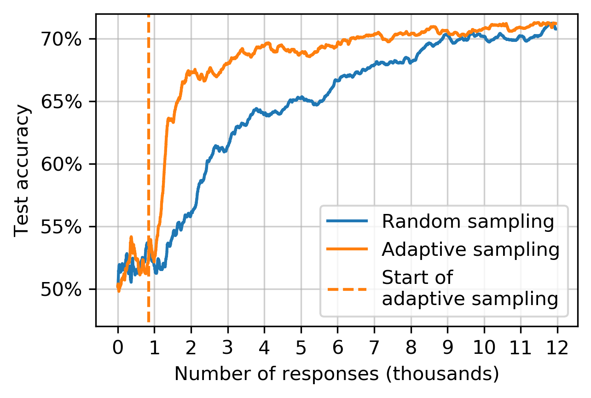

Adaptive algorithms
===================

Adaptive algorithms decide which questions to ask about, instead of asking
about a random question like random sampling. This can mean that higher
accuracies are reached sooner, or that less human responses are required to
reach a particular accuracy.

Let's run a quick benchmark with Salmon to see how well adaptive performs in
the crowdsourcing context. This benchmark will accurately simulate a
crowdsourcing context:

* Answers will be received by Salmon at a rate of 4 responses/second.
* The answers will come from the Zappos shoe dataset, an exhaustively sampled
  triplets dataset with 4 human responses to every possible question.
    * This dataset has :math:`n = 85` shoes, and I mirror Heim et. al and embed
      into :math:`d = 2` dimensions [1]_.
* The random and adaptive algorithms will be the same in every except in how
  how select queries.

With that setup, how much of a difference does query selection matter? Here's
an illustrative result:

This is an improvement over NEXT, the software that inspired Salmon. In NEXT's
introduction paper, the authors concluded "there is no evidence for gains from
adaptive sampling," [2]_, and their experimental results for t-STE (the same
method as used above) did not motivate the use of adaptive sampling algorithms.

.. [1] "Active Perceptual Similarity Modeling with Auxiliary Information" by E.
       Heim, M. Berger, and L. Seversky, and M. Hauskrecht. 2015.
       https://arxiv.org/pdf/1511.02254.pdf

.. [2] "NEXT: A System for Real-World Development, Evaluation, and Application
       of Active Learning" by K. Jamieson, L. Jain, C. Fernandez, N. Glattard
       and R. Nowak. 2017.
       http://papers.nips.cc/paper/5868-next-a-system-for-real-world-development-evaluation-and-application-of-active-learning.pdf
