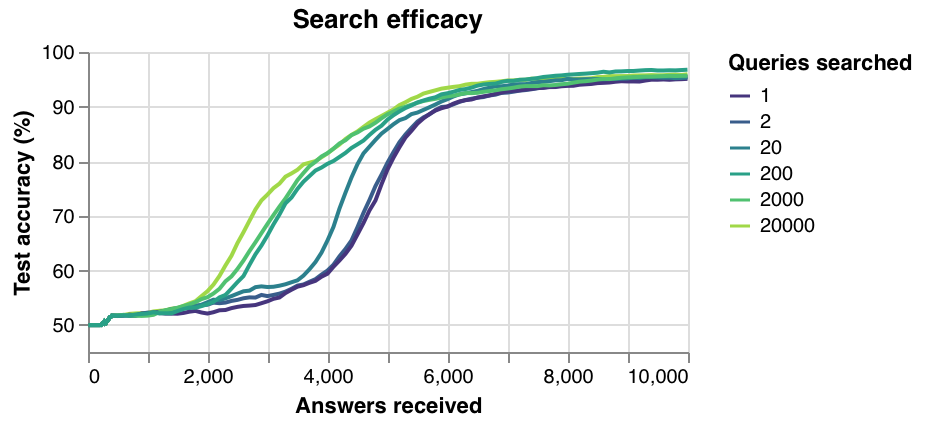

Adaptive algorithms
===================

Adaptive algorithms decide which questions to ask about, instead of asking
about a random question like random sampling. This can mean that higher
accuracies are reached sooner, or that less human responses are required to
reach a particular accuracy.

Illustrative result
-------------------

Let's run a quick benchmark with Salmon to see how well adaptive performs in
the crowdsourcing context. This benchmark will accurately simulate a
crowdsourcing context:

* Answers will be received by Salmon at a rate of 4 responses/second.
* The answers will come from the Zappos shoe dataset, an exhaustively sampled
  triplets dataset with 4 human responses to every possible question.
    * This dataset has :math:`n = 85` shoes, and I mirror Heim et. al and embed
      into :math:`d = 2` dimensions [1]_.
* The random and adaptive algorithms will be the same in every except in how
  how select queries.

With that setup, how much of a difference does query selection matter? Here's
a result that illustrates the benefit of adaptive algorithms:

.. image:: imgs/adaptive.png
   :width: 400px
   :align: center

This measure provide evidence to support the hypothesis that Salmon has better
performance than NEXT for adaptive triplet embeddings. For reference, in NEXT's
introduction paper, the authors provided "no evidence for gains from adaptive
sampling" for the triplet embedding problem [2]_.

.. [1] "Active Perceptual Similarity Modeling with Auxiliary Information" by E.
       Heim, M. Berger, and L. Seversky, and M. Hauskrecht. 2015.
       https://arxiv.org/pdf/1511.02254.pdf

.. [2] "NEXT: A System for Real-World Development, Evaluation, and Application
       of Active Learning" by K. Jamieson, L. Jain, C. Fernandez, N. Glattard
       and R. Nowak. 2017.
       http://papers.nips.cc/paper/5868-next-a-system-for-real-world-development-evaluation-and-application-of-active-learning.pdf

Search efficacy
---------------

Adaptive algorithms are more adaptive if they search more queries. Random sampling
can be thought of as an adaptive algorithm that only searches over one possible
query. An algorithm that searches over 50,000 queries is more adaptive than a
algorithm that can only search 50 queries.

How much do these searches matter? Let's run another experiment with this setup:

* Dataset: strange fruit dataset. The response model will be determined from human
  responses. There will be :math:`n=200` objects and that will be embedded into :math:`d=2`
  dimensions.
* Let's measure **search efficacy.** To aid this, let's say model updates run instantly.
  That means we'll run offline using essentially this code:

.. code-block:: python

   responses_per_search = 10
   n_search = 10
   alg = TSTE(n=n, d=d, ...)

   for k in itertools.count():
       queries, scores = alg.score_queries(num=n_search * responses_per_search)
       queries = _get_top_N_queries(queries, scores, N=responses_per_search)
       answers = [_get_answer(query) for query in queries]

       alg.partial_fit(answers)  # performs 1 pass over all answers received thus far

With that, we see this performance:

If you only have the budget for 4,000 queries the most complete search will reach about 82% accuracy. The least complete search will only reach about 60% accuracy.

If you want to reach 80% accuracy, the most complete searches will require about 3,800 queries. The least complete searches will require 5,100 queries.

