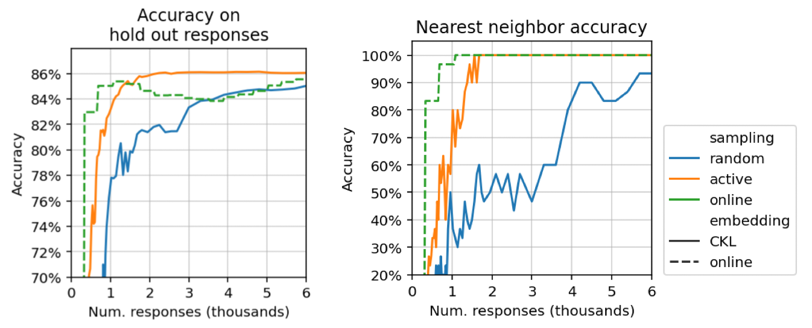

.. _experiments:

Adaptive algorithms
===================

Adaptive algorithms decide which questions to ask about, instead of asking
about a random question like random sampling. This can mean that higher
accuracies are reached sooner, or that less human responses are required to
reach a particular accuracy.

.. note::

   This page shows results of experiments run with Salmon.
   For complete details, see https://github.com/stsievert/salmon-experiments

Synthetic simulation
--------------------

Let's compare adaptive sampling and random sampling. Specifically, let's use
Salmon like an experimentalist would:

1. Launch Salmon with the "alien eggs" dataset, with :math:`n=30` objects
   embedded into :math:`d=2` dimensions.
2. Simulate human users (10 users with mean response time of 1s).
3. Download the human responses from Salmon
4. Generate the embedding offline.

Let's run this process for adaptive and random sampling. When we do that, this
is the graph that's produced:

These are synthetic results, though they use a human noise model. These
experiments provide evidence that Salmon works well with adaptive sampling.

This measure provides evidence that Salmon's active sampling approach
outperforms random sampling. If true, this is an improvement over existing
software to deploy triplet queries to crowdsourced audiences: in NEXT's
introduction paper, [2]_ the authors found "no evidence for gains from adaptive
sampling" for (nearly) the same problem. [#same]_

Simulation with human responses
-------------------------------

The Zappos shoe dataset has :math:`n=85` shoes, and asks every possible triplet
4 times to crowdsourcing users. Let's run a simulation with Salmon on that that
dataset. We'll embed into :math:`d = 3` dimensions, and have a response rate of
about 2.5 response/sec (5 users with an average response time of 2.5 seconds).

Let's again compare adaptive sampling and random sampling:

.. image:: imgs/zappos.png
   :width: 600px
   :align: center

The likelihood of a true response conveys "margin by which the models adhere to
all responses." [1]_ The performance above mirrors the performance by Heim et
al. in their Figure 3. [1]_

.. rubric:: References

.. [1] "Active Perceptual Similarity Modeling with Auxiliary Information" by E.
       Heim, M. Berger, and L. Seversky, and M. Hauskrecht. 2015.
       https://arxiv.org/pdf/1511.02254.pdf

.. [2] "NEXT: A System for Real-World Development, Evaluation, and Application
       of Active Learning" by K. Jamieson, L. Jain, C. Fernandez, N. Glattard
       and R. Nowak. 2017.
       http://papers.nips.cc/paper/5868-next-a-system-for-real-world-development-evaluation-and-application-of-active-learning.pdf

.. rubric:: Footnotes

.. [#same] Both experiment use :math:`n=30` objects and embed into :math:`d=2`
           dimensions. The human noise model used in the Salmon experiments is
           generated from the responses collected during NEXT's experiment. The
           are the same experiment, up to different responses (NEXT
           actually runs crowdsourcing experiments; Salmon's noise model is
           generated from those responses).

