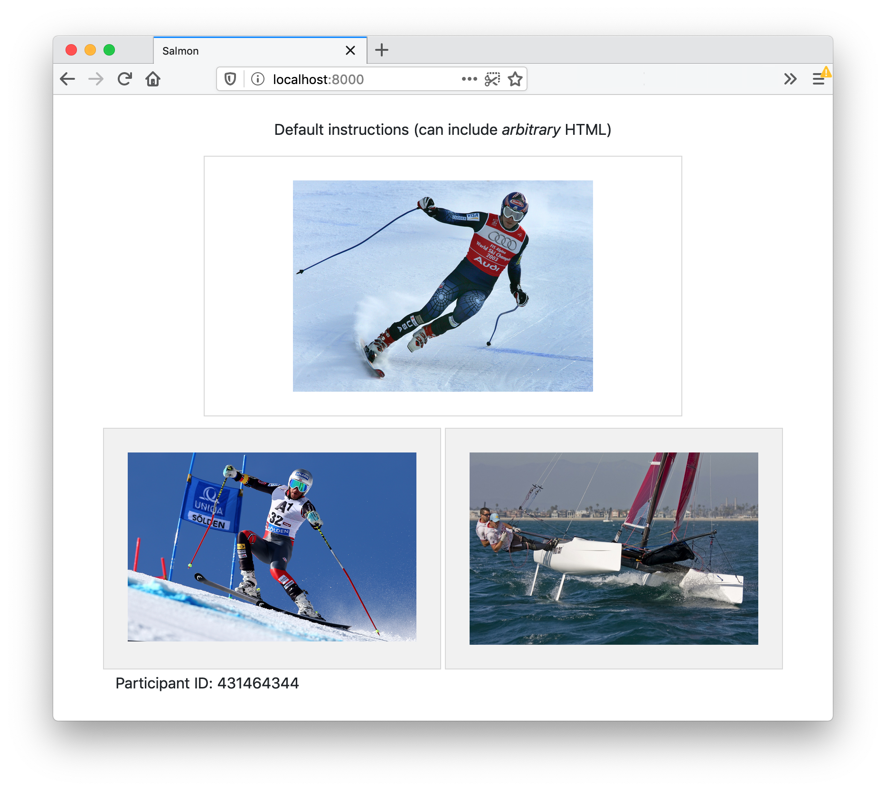

.. _getting-started:

Getting started
===============

Launching an experiment to crowdsourcing participants requires following this
process:

1. Visiting ``http://[url]:8421/init`` with the ``[url]`` from
   :ref:`installation`.
2. Creating a username/password
3. Launching an experiment.
4. Sending the URL ``http://[url]:8421/`` to crowdsourcing participants.

Initialization page
-------------------

By default, Salmon does not support HTTPS. Make sure the URL begins with
``http://``, not ``https://``. For example, the URL you visit may look like:

.. code::

   http://ec2-52-204-122-132.compute-1.amazonaws.com:8421/init

Username/password
-----------------

When visiting ``http://[url]:8421/init``, first, type a username/password and
hit "create user."

.. warning::

   Do not lose this username/password! You need the username/password to view
   the dashboard and download the received responses.

It is technically possible to recover the username/password with the key file
``key.pem`` that Amazon AWS provides and the URL above:

.. code-block:: shell

   (personal) $ ssh -i key.pem ubuntu@[url]
   (ec2) $ cat /home/ubuntu/salmon/creds.json

Experiment initialization
-------------------------

Hit the back button to visit ``http://[url]:8421/init`` again after after a
user has been successfully created. Now, let's launch an experiment! There are
three options:

1. Upload of a YAML file completely detailing the experiment.
2. Upload of a YAML file describing experiment, and ZIP file for the targets.
3. Upload of a database dump from Salmon.

These options are detailed at ":ref:`init`." If an experiment is incorrectly
specified, (hopefully helpful) errors will be raised. After the experiment is
finished launching, you will see a couple links:

* A link to the dashboard (``http://[url]:8421/dashboard``), an example of
  which is at ":ref:`exp-monitoring`."
* A link to the query page to send to crowdsourcing users
  (``http://[url]:8421/``).

.. _YAML specification: https://yaml.org/

Send the URL to participants
----------------------------

The URL to send to the crowdsourcing participants is ``http://[url]:8421/``.
Typically, paid services like Mechantical Turk are used to recruit
crowdsourcing participants. Reddit and email have been used for unpaid
recruitment. In either case, that may involve a URL of this form:

.. code::

   http://ec2-52-204-122-132.compute-1.amazonaws.com:8421/

Opening this URL in the browser will show (a newer version) of this page:

A couple notes:

* Customizing this page is possible and detailed in :ref:`frontendcustomization`.
* Tips on deploying this experiments can be found at :ref:`deploying`.

.. _HTML redirect: https://www.w3docs.com/snippets/html/how-to-redirect-a-web-page-in-html.html
.. _GitHub Pages: https://pages.github.com/
