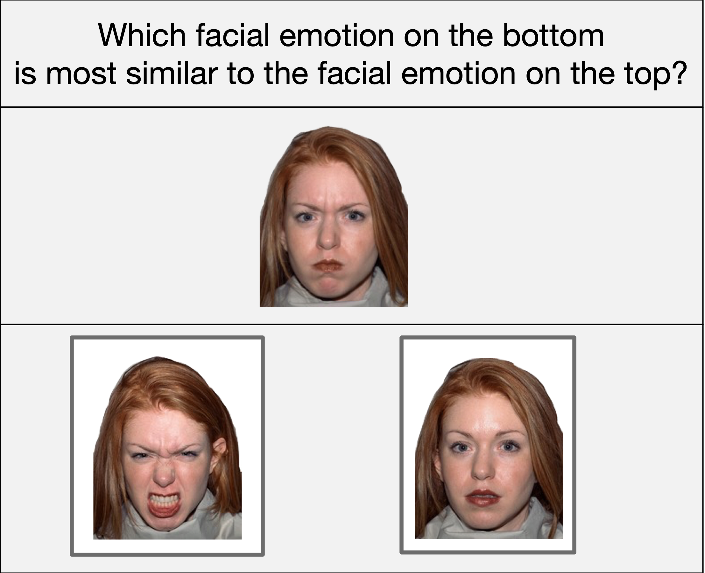
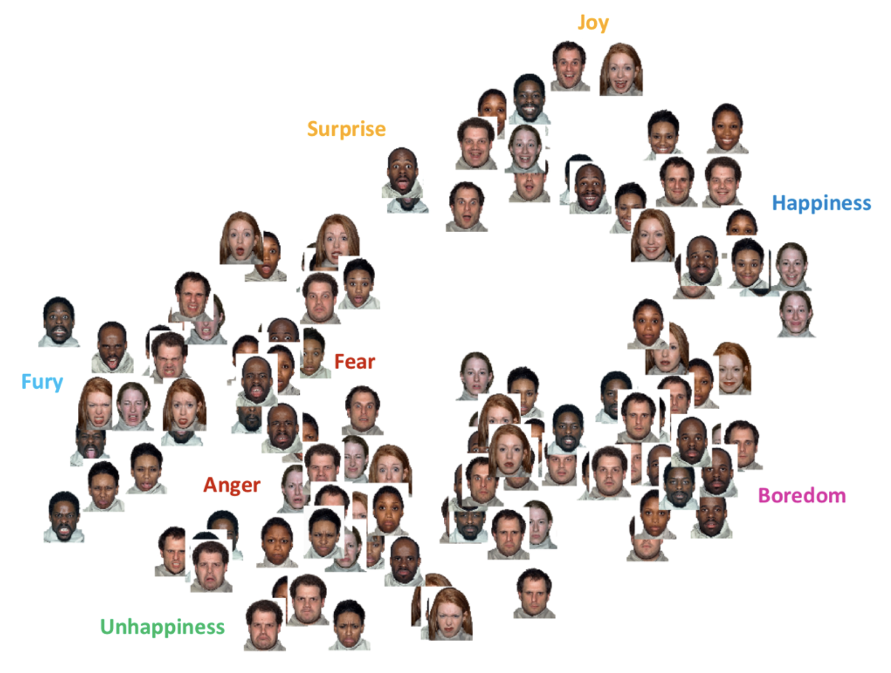

Welcome to Salmon's documentation!
==================================

Salmon is a tool to easily allow collection of "triplet queries." These queries
are of the form "is object :math:`a` more similar to object :math:`b` or
:math:`b`?" An example is shown below with facial similarities:

These queries are interesting because they provide some relative similarity
structure: a response might indicate that object :math:`a` is closer to object
:math:`b` than object :math:`c` as determined by humans and the instructions
they are given. For example, these triplet queries have been used by
psychologists to determine what facial emotions human find similar:

Only distance is relevant in this embedding, not the vertical/horizontal axes.
However, if you look closely, you can see two axes: positivity and intensity.

Salmon provides efficient methods for collecting these triplet queries.  Salmon
can be configured to only require (say) 10,000 answers from crowdsourcing
partipants to be (say) 95% confident in the result. Other approaches or Salmon
by default will require more responses to triplet queries (say 20,000) to reach
the same confidence.

.. toctree::
   :maxdepth: 2
   :caption: Usage

   installation
   getting-started
   monitoring
   offline
   algorithms
   api
   faq

.. toctree::
   :maxdepth: 2
   :caption: Benchmarks

   benchmarks/server
   benchmarks/adaptive

.. toctree::
   :maxdepth: 2
   :caption: Algorithm Developers

   adaptive
   developers

Indices and tables
==================

* :ref:`genindex`
* :ref:`modindex`
* :ref:`search`
