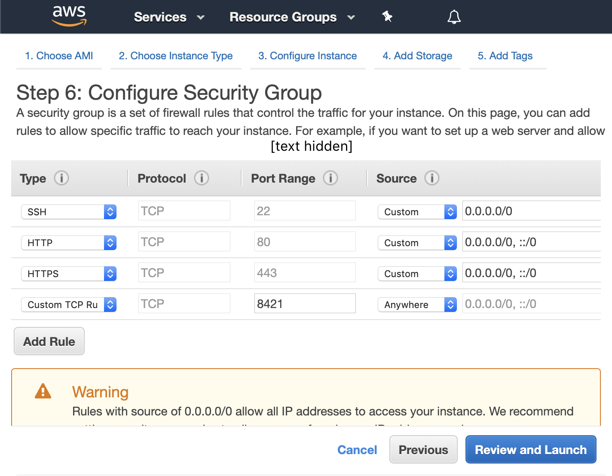

Installation
============

Experimentalist
---------------

.. warning::

   This process is only ready for testing. It is **not** ready for deployment.

1. Sign into Amazon AWS (http://aws.amazon.com/)
2. Select the "Oregon" region (or ``us-west-2``) in the upper right.
3. Go to Amazon EC2
4. Launch a new instance (the big blue button or square orange button).
5. Select AMI ``ami-0117acefda9941def`` titled "Salmon". It appears in
   Community AMIs after searching "Salmon".
6. Don't click the big blue button yet. Continue to the rules page, and add
   these rules:

Then after this AMI is finished launching and initializing, go to

- ``[url]:8421/init_exp`` to initialize an experiment
- ``[url]:8421/dashboard`` to view all relevant links, including links to
  the...

  * The **query page.** This is the URL that shows the relevant triplets. This
    is the URL to be sent to a crowdsourcing service.
  * **API documentation**. This includes information on how to launch an
    experiment, and what files need to be uploaded. View the documentation for
    the POST request ``/init_exp`` for more detail.
  * **Responses**. To get all human responses.
  * **Logs**. This is very useful for debugging.

.. warning::

   If you have an issue with the machine running Salmon, be sure to include the
   logs when contacting the Salmon developers. They'd also appreciate it if
   you left the machine running.

``[url]`` is the Amazon public DNS or public IP. This means that going to
``[url]:8421/foo`` might mean going to this URL:

.. code::

   http://ec2-35-164-240-184.us-west-2.compute.amazonaws.com:8421/foo

Local machine
-------------
On your local machine as a developer? Run this following code in a terminal:

.. code:: shell

   $ git clone https://github.com/stsievert/salmon.git

First, `install Docker`_ and `install Git`_. After that, run the following code:

.. _install Docker: https://www.docker.com/products/docker-desktop
.. _install Git: https://git-scm.com/downloads

.. code:: shell

   $ cd salmon
   $ docker-compose build
   $ docker-compose up
   $ # visit http://localhost:8421/init_exp or http://localhost:8421/docs

Developer
---------
Follow the instructions for local machine launch.

If you make changes to this code, follow these instructions:

.. code:: shell

	$ docker-compose stop
	$ docker-compose build
	$ docker-compose up
