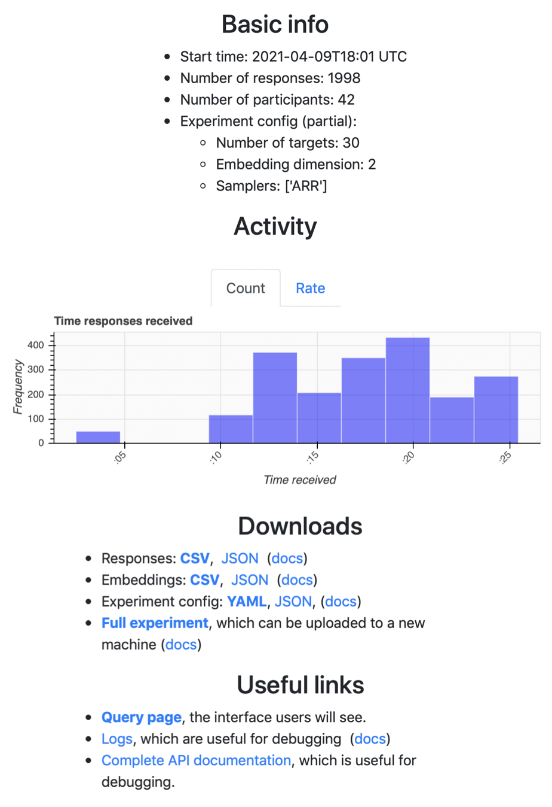

.. _exp-monitoring:

Experiment monitoring
=====================

While participants are answering queries, you can track the state of the
experiment by visiting ``http://[url]:8421/dashboard``. Initially, this will be
fairly barren because users haven't responded.

After users respond, the dashboard will show the following information:

* **Basic information** (start time, number of participants, etc)
* **User response times** (e.g., when did the users respond?)
* **Server side timing** (e.g., how long did it take to process each API
  endpoint?)
* **Client side timing** (e.g., how long did they spend waiting or thinking
  about their response?)
* **Algorithm timing** (e.g., how long do model updates take?)
* An **embedding** for each algorithm.
* The list of targets.

.. raw:: html

   
Below, we'll show <i>static</i> images of the dashboard.
   A mostly-complete dashboard example is visible at
   <a href="./dashboard.html">dashboard.html</a>.
   Here are some screenshots from the dashboard:

Basic information
-----------------

Bolded links are particularly useful. I download all bolded links before
stopping or restarting the machine running Salmon (except the query page).

Server side timing
------------------

.. image:: imgs/dashboard/server-side.png
   :align: center
   :width: 600px

Client side timing
------------------
.. image:: imgs/dashboard/client-side.png
   :align: center
   :width: 500px

Embeddings
----------

Algorithm timing
----------------

Database
--------

Targets
-------

I only show the first 4 targets below; the other targets can be seen in the
embedding above.

