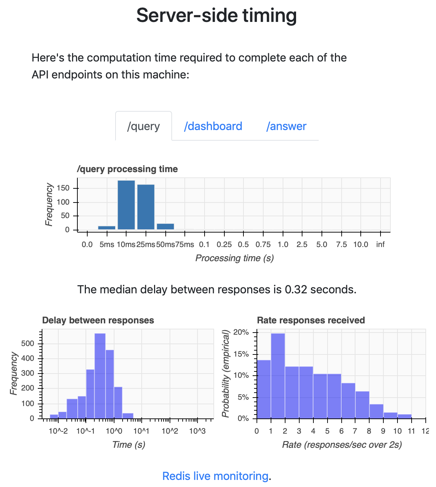

.. _exp-monitoring:

Experiment monitoring
=====================

While participants are answering queries, you can track the state of the
experiment by visiting ``[url]:8421/dashboard``. Initially, this will be fairly
barren because users haven't responded.

After users respond, the dashboard will show the following information:

* **Basic information** (start time, number of participants, etc)
* **User response times** – when did the users respond?
* **Server side timing** – how long did it take to process each API endpoint?
* **Client side timing** – how long did they spend waiting or thinking about their
  response?
* **Algorithm timing** – how long did each part of the algorithm take?
* An embedding for each algorithm.
* The list of targets (rendered as raw HTML).

.. raw:: html

   
Below, we'll show examples of most of the dashboard, but leave out the
   embedding and list of targets. A full dashboard example is visible at
   <a href="./dashboard.html">dashboard.html</a>.
   Here are some screenshots from the dashboard:

Basic information
-----------------
.. image:: imgs/dashboard/basic.png
   :align: center
   :width: 450px

Bolded links are particularly useful. I download all bolded links before
stopping or restarting the machine running Salmon (except the query page).

Server side timing
------------------

Client side timing
------------------

Algorithm timing
----------------
.. image:: imgs/dashboard/alg-timing.png
   :align: center
   :width: 500px
