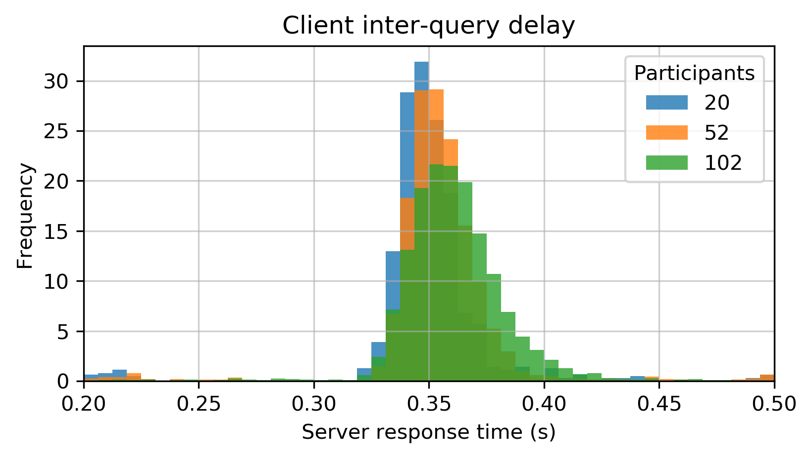
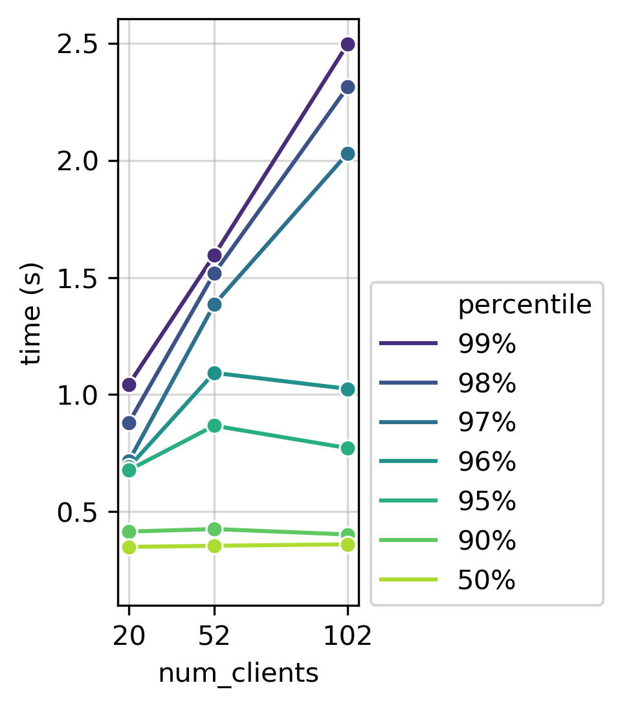

Concurrent Users
================

Salmon v0.2.3 can handle up to at least 100 simultaneous users interacting
with the system and answering questions. Here's the setup:

* Launched Salmon on a Amazon EC2 ``t3.large`` instance.
* Simulated client response time using the most similar task I could find
  [#1]_.  Response times were a modified Gaussian random variable with mean 750ms and
  standard deviation 250ms (modified so always greater than 200ms).
* Each client for 50 responses.

Here are the performance results with that setup:

This performance is pretty good! Most of the responses return in around 400ms.
How do the extremes perform?

45 of a users queries will return in less than 500ms if the user answers 50
questions and there are 102 simultaneous clients.

.. [#1] Specifically, a spatial configuration task with 3 elements.
        I pulled number from Figure 6 of Palmer et. al [palmer]_.

.. [palmer] "What are the shapes of response time distributions in visual search?"
            Palmer, Horowitz, Torralba, & Wolfe (2011).  Journal of experimental
            psychology.  https://doi.org/10.1037/a0020747
